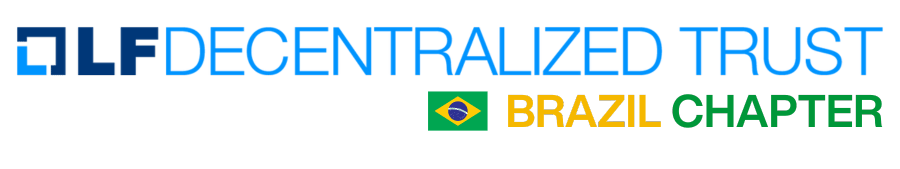

# Linux Foundation Decentralized Trust (LFDT) - Capítulo Brasil

Bem-vindo ao repositório oficial do **Capítulo Brasil da Linux Foundation Decentralized Trust (LFDT)**.  
Este espaço tem como objetivo organizar, documentar e compartilhar as iniciativas da comunidade brasileira em torno de blockchain, identidade digital, tokenização de ativos e tecnologias descentralizadas.

Estamos em processo de migração da [plataforma antiga](https://lf-hyperledger.atlassian.net/wiki/spaces/CP/pages/17432619/Linux+Foundation+Decentralized+Trust+-+Brazil+Chapter+Cap+tulo+Brasil) para este novo espaço.

## Sobre a LFDT
A **Linux Foundation Decentralized Trust (LFDT)** é a evolução da Hyperledger Foundation, atuando globalmente para promover ecossistemas abertos, confiáveis e interoperáveis de tecnologias descentralizadas.

O Capítulo Brasil faz parte dessa rede internacional de comunidades locais, conectando desenvolvedores, empresas, pesquisadores, reguladores e a sociedade civil para colaborar no desenvolvimento e adoção dessas tecnologias no país.

## Objetivos do Capítulo Brasil
- Promover a troca de conhecimento e experiências em blockchain e tecnologias descentralizadas.  
- Apoiar a criação de projetos colaborativos com impacto local e global.  
- Conectar a comunidade brasileira ao ecossistema internacional da LFDT.  
- Fomentar boas práticas de governança, privacidade, interoperabilidade e segurança.  
- Aproximar academia, setor público, mercado e sociedade civil.  

## Como participar
O Capítulo Brasil é uma comunidade aberta. Todos são bem-vindos a contribuir.  
Você pode participar de diferentes formas:

- Participar dos eventos e meetups promovidos pelo Capítulo Brasil.  
- Entrar nos canais de comunicação (Discord, LinkedIn, listas de e-mail).  
- Contribuir com projetos e iniciativas em andamento.  
- Ajudar na produção de conteúdo, tradução e documentação.  

Mais detalhes em [`/docs/resources/onboarding.md`](./docs/resources/onboarding.md)

## Eventos
Organizamos eventos presenciais e online para compartilhar conhecimento e fortalecer a comunidade.

Alguns eventos já realizados:
- Hyperledger Day @ Blockchain Rio (2024)  
- Tokenização de Ativos Reais (2024)  
- Ptah: Privacidade e Interoperabilidade para Ecossistemas Financeiros (2025)  

Lista completa em [`/docs/events/`](./docs/events/)

## Projetos
O Capítulo Brasil apoia discussões e provas de conceito em áreas como:
- Identidade Digital  
- Tokenização de Ativos Imobiliários  
- Integração com o Real Digital (DREX)  
- Privacidade e Interoperabilidade (Framework Ptah)  

Mais em [`/docs/projects/`](./docs/projects/)

## Governança
O Capítulo Brasil segue o [Charter Global da LFDT](https://www.lfdecentralizedtrust.org) e possui diretrizes próprias de atuação local.

- Chairs: responsáveis pela coordenação geral do Capítulo Brasil.  
- Voluntários: membros que apoiam projetos, eventos e iniciativas.  

Detalhes em [`/docs/governance/charter.md`](./docs/governance/charter.md)

## Recursos
- [`/docs/resources/communication-channels.md`](./docs/resources/communication-channels.md) – como entrar em contato  
- [`/docs/resources/faq.md`](./docs/resources/faq.md) – perguntas frequentes  
- [`/docs/resources/onboarding.md`](./docs/resources/onboarding.md) – guia para novos membros  

## Licença
Este repositório e sua documentação estão disponíveis sob a licença **Creative Commons Attribution 4.0 International (CC BY 4.0)**, salvo indicação em contrário.  

Para dúvidas e sugestões, entre em contato pelo [LinkedIn](https://www.linkedin.com/company/lfdtbrasil) ou participe dos nossos eventos no [Meetup](https://www.meetup.com/lfdt-sao-paulo).
